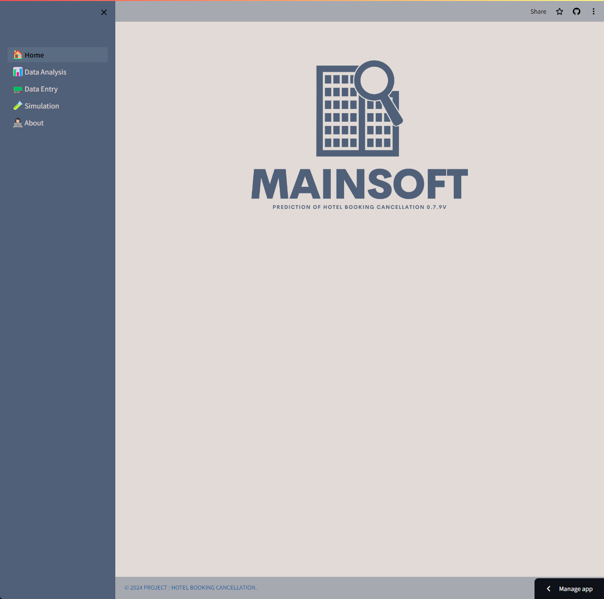
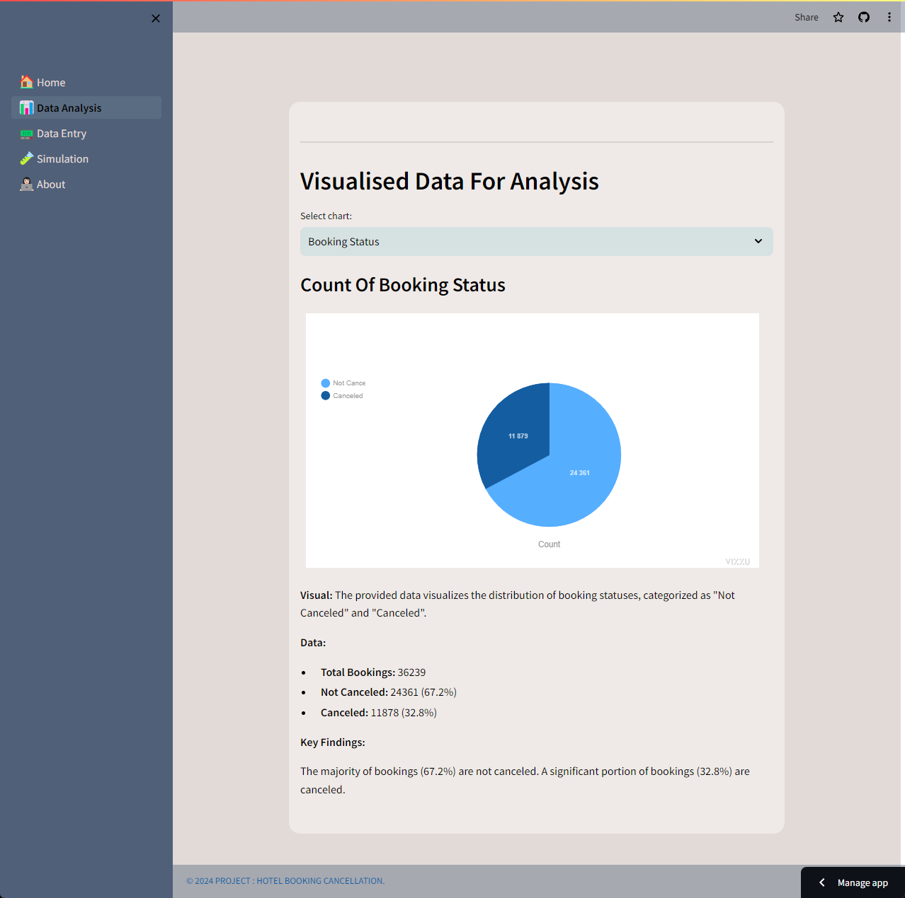
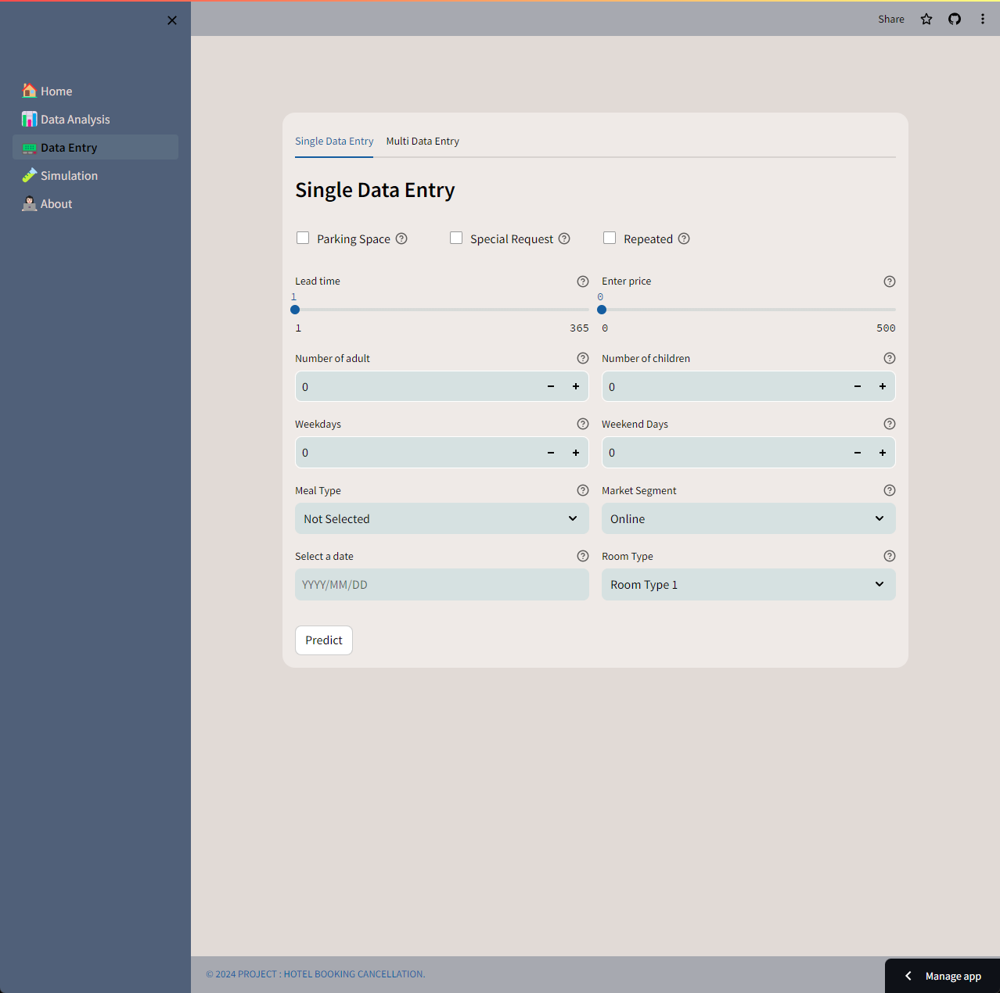
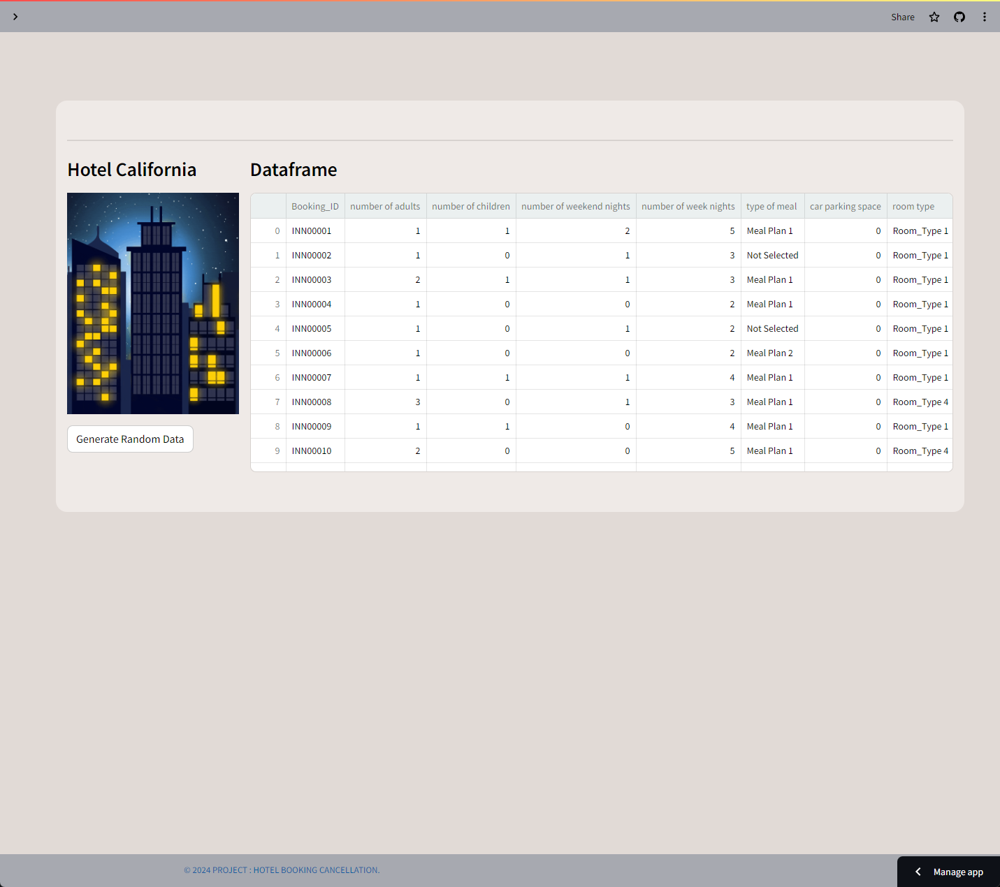

# Hotel Booking Cancellation Prediction

**This project aims to predict hotel booking cancellations using machine learning techniques. We utilized a dataset available on Kaggle, sourced from [here](https://www.kaggle.com/datasets/youssefaboelwafa/hotel-booking-cancellation-prediction).**

## Data Preparation

During the data preparation phase, we followed these steps:

### Exploratory Data Analysis (EDA)

- We thoroughly examined the dataset, analyzing the columns present, their types, and distributions.
- Identified missing values in the dataset and handled them using appropriate methods or strategies.
- Explored the relationships between columns and investigated correlations between variables.

### Feature Engineering

- Derived new features from existing columns. For example, we calculated the difference between the booking date and the cancellation date to derive the booking lead time.
- Converted categorical variables into numerical values using techniques such as one-hot encoding or label encoding.
- Removed unnecessary or redundant columns to prepare the dataset for modeling.

## Model Development

In the model development phase, we followed these steps:

### Model Selection

- We experimented with different algorithms such as LightGBM, CART (Classification and Regression Trees), and K-Nearest Neighbors (KNN).
- Before applying these models, we split the dataset into training and testing sets and also utilized cross-validation techniques.

### Hyperparameter Tuning

- Tuned the hyperparameters of the models to improve performance using techniques such as Grid Search and Random Search.
- Determined the best-performing hyperparameters for each model.

### Model Evaluation

- Evaluated the models using performance metrics such as accuracy, precision, recall, and F1-score.
- Visualized the overall performance of the model using techniques like confusion matrix and ROC curve.

### Final Model Selection

- Selected the LightGBM model, which demonstrated the best performance among all models.
- Evaluated the selected model on the test set and ensured its performance.

**These steps ensured the successful execution of the project, and as a result, we implemented the LightGBM model in the web application for users.**

## Web Application

**We developed a user-friendly web application using Streamlit, offering the following features:**

### Data Visualization

- We designed an interactive page with integrated Vizzu charts, allowing users to explore the dataset visually through dynamic animated charts. Users can customize the charts based on different variables, providing insights into trends and patterns within the data.

### Data Input and Prediction

- This section provides users with the capability to input data and receive predictions from our trained model. We split this page into two tabs:

  - **Single Data Point Prediction**: Users can input individual data points related to a hotel booking, including features such as lead time, arrival date, booking channel, etc. They can then observe the model's prediction on whether the booking will be canceled or not. Additionally, we provide explanations on how each feature influences the prediction.

  - **Multiple Data Points Prediction**: Users can input multiple data points simultaneously, either by uploading a CSV file or by manually entering data. The application provides predictions for all inputted data points, facilitating bulk analysis and decision-making.

### Simulation

- In this section, users can simulate predictions on a subset of the original dataset:

  - **Random Observation Selection**: Users can randomly select 38 observations from the dataset to simulate real-world scenarios.
  - **Dynamic Visualization**: We integrated OpenCV to generate dynamic images and gifs, enhancing the visualization of predictions. Users can quickly observe the predictions alongside the original data points, aiding in understanding the model's performance.

### About

- Finally, the about page offers background information about our team and the dataset used:

  - **Team Information**: We provide details about the team members involved in the project, including their roles and expertise.
  - **Dataset Details**: Users can find information about the dataset used for training the model, including its source, attributes, and any preprocessing steps applied.

**Overall, our web application provides a comprehensive platform for users to explore, analyze, and understand hotel booking cancellations using machine learning techniques.**

